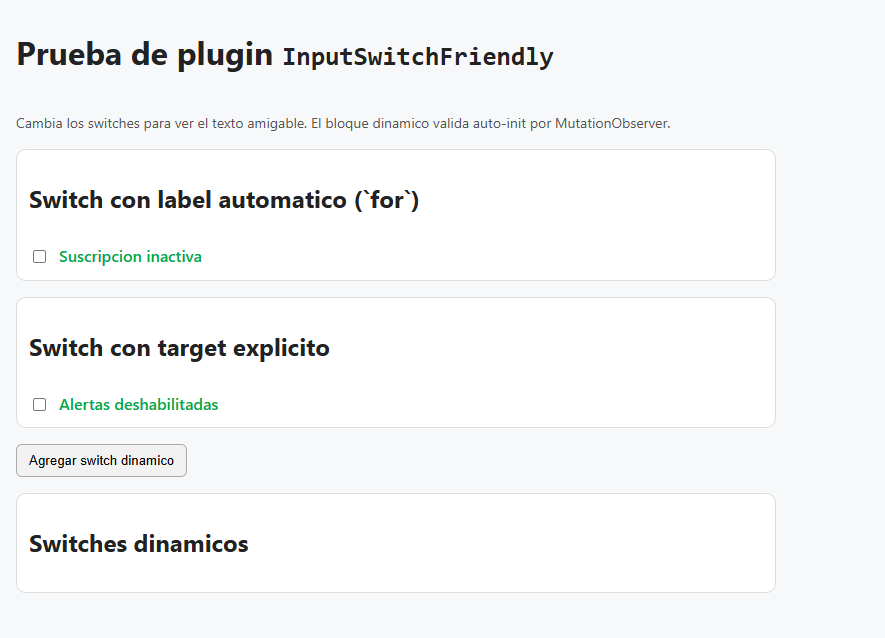
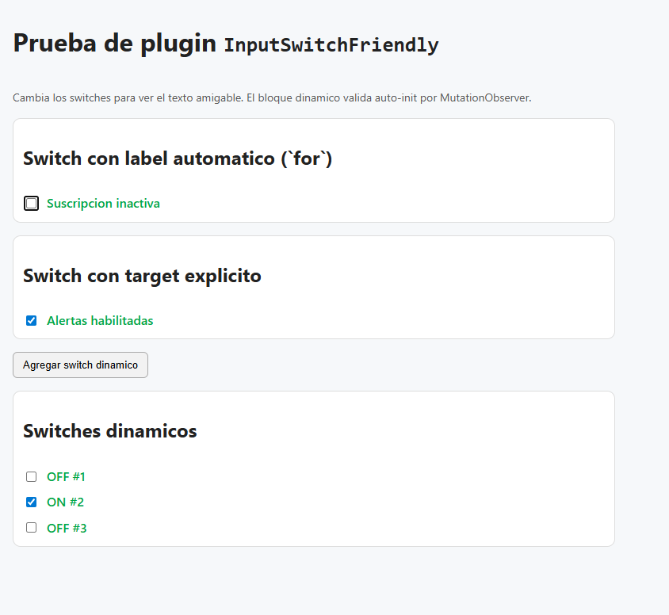

# InputSwitchFriendly

Native JavaScript plugin to display a friendly text based on a switch/checkbox input state.

## Requirements

- A modern browser with support for `MutationObserver`, `WeakMap`, and `queueMicrotask`
- An input with `data-role="friendly-switch"`
- State text attributes (`data-friendly-switch-checked` and `data-friendly-switch-unchecked`)

## Installation

Include only the plugin:

```html
<script src="./inputSwitchFriendly.js"></script>
```

For production usage, if you do not need to read the source code, you can include the minified file:

```html
<script src="./inputSwitchFriendly.min.js"></script>
```

## Basic Usage

```html
<input
  id="termsSwitch"
  type="checkbox"
  data-role="friendly-switch"
  data-friendly-switch-checked="Accepted"
  data-friendly-switch-unchecked="Pending" />

<label for="termsSwitch"></label>
```

That is enough. The plugin initializes automatically when the DOM is ready.

## How It Works

- Finds inputs with `data-role="friendly-switch"`.
- Reads labels from:
  - `data-friendly-switch-checked`
  - `data-friendly-switch-unchecked`
- Uses target destination as:
  - `data-friendly-switch-target` if present.
  - Otherwise, it tries `label[for="inputId"]`.
- On each `change`, it updates target text based on switch state.

## Supported `data-*` attributes

- `data-role="friendly-switch"`: marks the input as plugin subject through auto-init. Status: **required for auto-initialization**.
- `data-friendly-switch-checked`: text shown when the input is checked. Status: **required**.
- `data-friendly-switch-unchecked`: text shown when the input is unchecked. Status: **required**.
- `data-friendly-switch-target`: CSS selector of the destination node where text is written. Status: **optional/conditional** (if omitted, plugin tries `label[for="id"]`; if there is no `id`, this attribute is recommended).

## Automatic Initialization

The plugin auto-initializes on:

- `[data-role="friendly-switch"]`

It also uses `MutationObserver` to initialize dynamically added nodes and tear down instances when those nodes actually leave the document.

## Manual Initialization (optional)

```html
<script>
  InputSwitchFriendly.init(document.querySelector('#termsSwitch'));
  InputSwitchFriendly.initAll(document.querySelector('#myForm'));
</script>
```

## Public API

```html
<script>
  const input = document.querySelector('#termsSwitch')
      , instance = InputSwitchFriendly.init(input);

  InputSwitchFriendly.getInstance(input);
  InputSwitchFriendly.destroy(input);
  InputSwitchFriendly.destroyAll(document.querySelector('#myForm'));

  instance.destroy();
</script>
```

- `InputSwitchFriendly.init(element, options)`: creates or reuses an instance.
- `InputSwitchFriendly.getInstance(element)`: returns current instance or `null`.
- `InputSwitchFriendly.destroy(element)`: tears down a specific instance.
- `InputSwitchFriendly.destroyAll(root)`: tears down all instances inside a container.
- `instance.destroy()`: removes listeners for current instance.

## Common Errors

- Missing `id` and missing `data-friendly-switch-target`: target element cannot be resolved.
- Missing `data-friendly-switch-checked` or `data-friendly-switch-unchecked`: change listener is not bound.

## Demo

You can open the test file included in this project:

- `test-input-switch-friendly.html`

## Example Preview

Initial HTML state:



State with some inputs checked and others unchecked:



