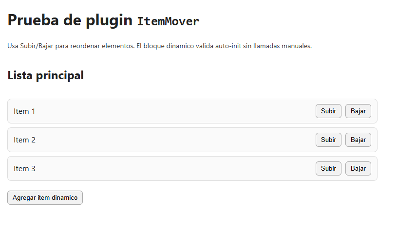
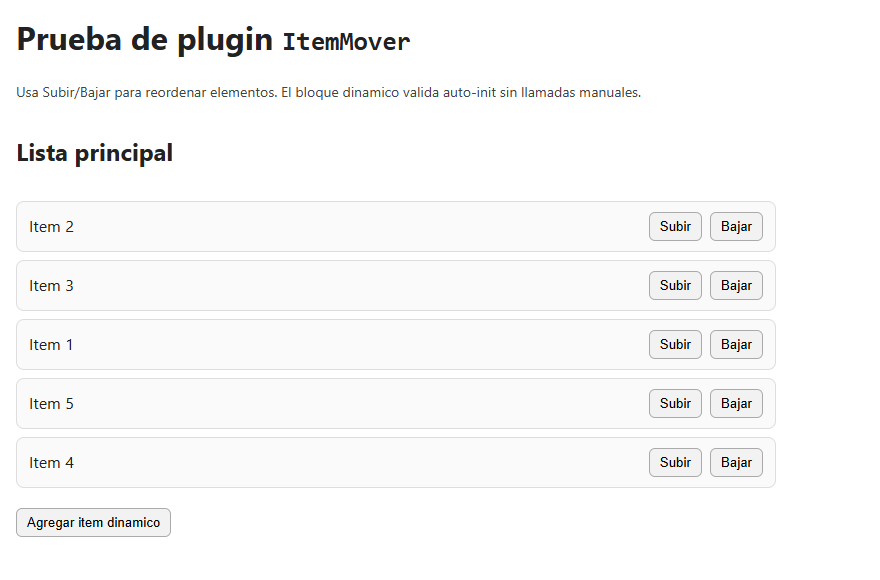

# ItemMover

Plugin JavaScript nativo para mover elementos HTML dentro de una lista o coleccion.

## Que viene a solucionar

Resuelve la necesidad de reordenar elementos en listas sin implementar manualmente logica de nodos y eventos por cada componente.

## Beneficios

- Simplifica el reorder de items con atributos declarativos.
- Reduce errores al manipular el DOM manualmente.
- Mejora reutilizacion en listas de tareas, tablas y cards.
- Mantiene una API uniforme en distintos modulos.

## Requisitos

- Un navegador moderno con soporte para `MutationObserver`, `WeakMap` y `queueMicrotask`
- Un disparador con `data-role="move-item"`
- Un selector objetivo con `data-move-target`

## Instalacion

Incluye solo el plugin:

```html
<script src="./itemMover.js"></script>
```

Para uso en produccion, si no necesitas leer el codigo fuente, puedes incluir la version minificada:

```html
<script src="./itemMover.min.js"></script>
```

## Uso Basico

```html
<ul>
  <li class="task-item">
    <button
      type="button"
      data-role="move-item"
      data-move-target=".task-item"
      data-move-direction="previous">
      Subir
    </button>
    Item A
  </li>

  <li class="task-item">
    <button
      type="button"
      data-role="move-item"
      data-move-target=".task-item"
      data-move-direction="next">
      Bajar
    </button>
    Item B
  </li>
</ul>
```

Con eso basta. El plugin se inicializa automaticamente al cargar el DOM.

## Como Funciona

- Busca elementos con `data-role="move-item"`.
- Toma `data-move-target` para ubicar el item actual (`closest`).
- Usa `data-move-direction` para decidir si mover contra el elemento anterior o siguiente.
- Intercambia ambos nodos en el DOM.

## Direcciones Soportadas

- `previous`
- `next`

## Atributos `data-*` soportados

- `data-role="move-item"`: marca el trigger que dispara el movimiento por auto-init. Estado: **requerido en auto-inicializacion**.
- `data-move-target`: selector para ubicar con `closest(...)` el item que se movera. Estado: **requerido**.
- `data-move-direction`: direccion del movimiento (`previous` para subir, `next` para bajar). Estado: **opcional** (por defecto usa `next`).

## Inicializacion Automatica

El plugin se auto-inicializa sobre:

- `[data-role="move-item"]`

Ademas, usa `MutationObserver` para inicializar triggers agregados dinamicamente al DOM y desmontar instancias cuando esos nodos salen realmente del documento.

## Inicializacion Manual (opcional)

```html
<script>
  ItemMover.init(document.querySelector('#btnMover'));
  ItemMover.initAll(document.querySelector('#miLista'));
</script>
```

## API publica

```html
<script>
  const trigger = document.querySelector('#btnMover')
      , instance = ItemMover.init(trigger);

  ItemMover.getInstance(trigger);
  ItemMover.destroy(trigger);
  ItemMover.destroyAll(document.querySelector('#miLista'));

  instance.destroy();
</script>
```

- `ItemMover.init(element, options)`: crea o reutiliza una instancia.
- `ItemMover.getInstance(element)`: devuelve la instancia actual o `null`.
- `ItemMover.destroy(element)`: desmonta una instancia concreta.
- `ItemMover.destroyAll(root)`: desmonta todas las instancias dentro de un contenedor.
- `instance.destroy()`: elimina listeners de la instancia actual.

En uso normal no hace falta llamar `destroy()`: si el nodo se elimina del DOM, el plugin intenta desmontarlo automaticamente.

## Errores comunes

- Falta `data-move-target`: se lanza error.
- `data-move-direction` invalido: se lanza error.

## Demo

Puedes abrir el archivo de prueba incluido en este proyecto:

- `test-item-mover.html`

## Vista previa del ejemplo

Estado inicial del HTML:



Estado con algunos items movidos de su posicion original:




## Configuracion Del Observer Del Plugin

Si quieres limitar el `MutationObserver` de este plugin a un contenedor especifico, define un root directo:

```html
<section data-pp-observe-root-item-mover>...</section>
```

Prioridad de root para el plugin:

1. `data-pp-observe-root-item-mover`
2. `data-pp-observe-root` en `<html>`
3. `document.body`

#### ℹ️ Para detalles sobre el patrón de observers y cómo optimizar la inicialización automática de plugins, revisa la sección [Patrón Recomendado De Observers](../README.md#patron-recomendado-de-observers) en el README principal.

## Licencia

Este plugin se distribuye bajo la licencia MIT.
Consulta el archivo LICENSE en la raíz del repositorio para los términos completos.

Copyright (c) 2026 Samuel Montenegro