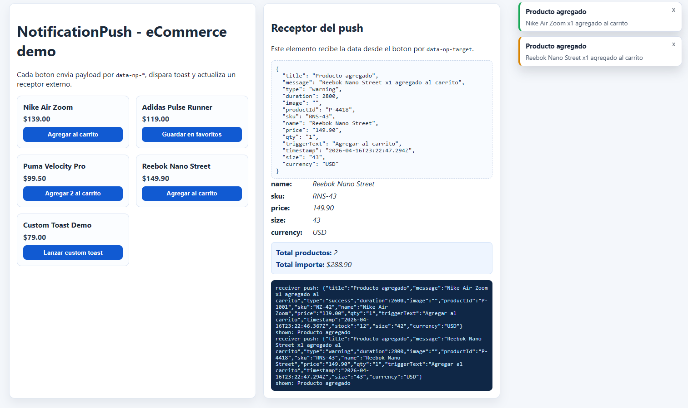

# NotificationPush

## What it does

NotificationPush triggers toast notifications from buttons/links using `data-*` attributes and builds a dynamic payload without browser cache storage.

## Problem it solves

In eCommerce/catalog flows, teams usually write repeated JS to read product info, show feedback notifications, and sync side panels (cart, wishlist, etc.).

## Benefits

- Declarative flow through `data-notification-push`.
- Flexible payload with dynamic `data-np-name-*` attributes.
- Can push data to another receiver element in the same view.
- Can show toast and optionally send payload with `fetch` using `cache: 'no-store'`.

## Requirements

- JavaScript with ECMAScript 2020 syntax.

## When it works and when it may fail

It works well when:

- The trigger exists in the DOM and has `data-notification-push`.
- If you use a receiver, `data-np-target` points to a valid selector currently in the view.
- `data-np-field` nodes exist in the expected scope (or you set `data-np-field-root`).
- The endpoint allows CORS/credentials as configured when `data-np-send="true"`.

It may fail or appear incomplete when:

- `data-np-target` selector is invalid or missing at runtime.
- Trigger or receiver nodes are removed from DOM before click/process.
- Network blockers, CORS rules, or HTTP errors prevent backend send.
- You disable internal styles (`data-np-inject-styles="false"`) but do not provide custom toast CSS.

## Include in HTML

```html
<script src="./notificationPush.min.js"></script>
```

## Receiver concept

A trigger can point to another element using `data-np-target="#selector"`.
That element receives push data and dispatches `push.plugin.notificationPush`.

```html
<button
  data-notification-push
  data-np-target="#cartReceiver"
  data-np-name-product-id="P-1001"
>
  Add
</button>

<div id="cartReceiver" data-np-receiver data-np-receiver-format="json"></div>
```

## Main attributes

- `data-notification-push`: enables plugin on trigger.
- `data-np-title`: toast title.
- `data-np-message`: toast message.
- `data-np-type="success|info|warning|error"`: visual notification type.
- `data-np-duration="4200"`: duration in ms.
- `data-np-image="https://..."`: optional toast image.
- `data-np-target="#selector"`: receiver element selector.
- `data-np-inject-styles="true|false"`: injects (or not) the default toast CSS.
- `data-np-toast-class="class1 class2"`: extra classes for each toast item.
- `data-np-toast-container-class="class1 class2"`: extra classes for global toast container.

## Built-in toast variants

The plugin includes 4 built-in visual variants (when `data-np-inject-styles` is `true`):

- `success` -> class `np-toast--success`
- `info` -> class `np-toast--info`
- `warning` -> class `np-toast--warning`
- `error` -> class `np-toast--error`

Examples:

```html
<button data-notification-push data-np-type="success" data-np-title="OK" data-np-message="Operation successful">Success</button>
<button data-notification-push data-np-type="info" data-np-title="Info" data-np-message="Informational message">Info</button>
<button data-notification-push data-np-type="warning" data-np-title="Warning" data-np-message="Please review this">Warning</button>
<button data-notification-push data-np-type="error" data-np-title="Error" data-np-message="Something went wrong">Error</button>
```

## Toast customization (your own style)

If you want full visual control, disable internal styles and provide your own classes:

```html
<button
  data-notification-push
  data-np-title="Custom"
  data-np-message="Toast with custom design"
  data-np-inject-styles="false"
  data-np-toast-class="my-toast my-toast--ok"
  data-np-toast-container-class="my-toast-stack"
>
  Show
</button>
```

You can also set this via API:

```html
<script>
  NotificationPush.init(document.querySelector('[data-notification-push]'), {
    injectDefaultStyles: false,
    toastClass: 'my-toast my-toast--ok',
    toastContainerClass: 'my-toast-stack'
  });
</script>
```

### Flexible payload (dynamic)

Any attribute with `data-np-name-` prefix is included in final payload.

Example:

- `data-np-name-stock="12"` -> `payload.stock = "12"`
- `data-np-name-size="42"` -> `payload.size = "42"`
- `data-np-name-currency="USD"` -> `payload.currency = "USD"`

This lets you send any extra info without changing plugin code.

## Optional backend send (no cache)

- `data-np-send="true|false"`
- `data-np-endpoint="/api/notify"`
- `data-np-method="POST|GET|..."`
- `data-np-headers-json='{"X-Key":"value"}'`
- `data-np-credentials="same-origin|include|omit"`

When sending with `fetch`, plugin uses `cache: 'no-store'`.

## Minimal example

```html
<button
  data-notification-push
  data-np-title="Item added"
  data-np-message="Item added to cart"
  data-np-type="success"
  data-np-target="#cartReceiver"
  data-np-name-product-id="P-1001"
  data-np-name-stock="12"
>
  Add to cart
</button>

<div id="cartReceiver" data-np-receiver data-np-receiver-format="json"></div>
```

## Public API

```html
<script>
  const trigger = document.querySelector('[data-notification-push]');

  const instance = window.NotificationPush.init(trigger, {
    defaultType: 'success',
    defaultDuration: 4200,
    showToast: true,
    injectDefaultStyles: true,
    toastClass: '',
    toastContainerClass: '',
    sendRequest: false,
    endpoint: '',
    requestMethod: 'POST',
    credentials: 'same-origin',
    headers: { 'Content-Type': 'application/json' },
    onBeforePush: function (payload, triggerEl) {
      console.log('before', payload, triggerEl);
    },
    onShown: function (payload, triggerEl) {
      console.log('shown', payload, triggerEl);
    },
    onSent: function (payload, response, triggerEl) {
      console.log('sent', payload, response.status, triggerEl);
    },
    onError: function (error, payload, triggerEl) {
      console.log('error', error, payload, triggerEl);
    }
  });

  window.NotificationPush.getInstance(trigger);
  window.NotificationPush.destroy(trigger);
  window.NotificationPush.initAll(document);
  window.NotificationPush.destroyAll(document);
</script>
```

Main methods:

- `window.NotificationPush.init(element, options)`: creates or reuses an instance.
- `window.NotificationPush.getInstance(element)`: returns current instance or `null`.
- `window.NotificationPush.destroy(element)`: destroys a specific instance.
- `window.NotificationPush.initAll(root)`: initializes all compatible triggers.
- `window.NotificationPush.destroyAll(root)`: destroys instances inside a container.

## Events

- `before.plugin.notificationPush`: before processing push (cancelable).
- `shown.plugin.notificationPush`: when notification is shown.
- `sent.plugin.notificationPush`: when backend send succeeds.
- `error.plugin.notificationPush`: when send/process error happens.
- `push.plugin.notificationPush`: emitted on receiver with payload.

## Demo

- `test-notification-push.html`

## Preview

Sample from the HTML demo showing some notifications:


