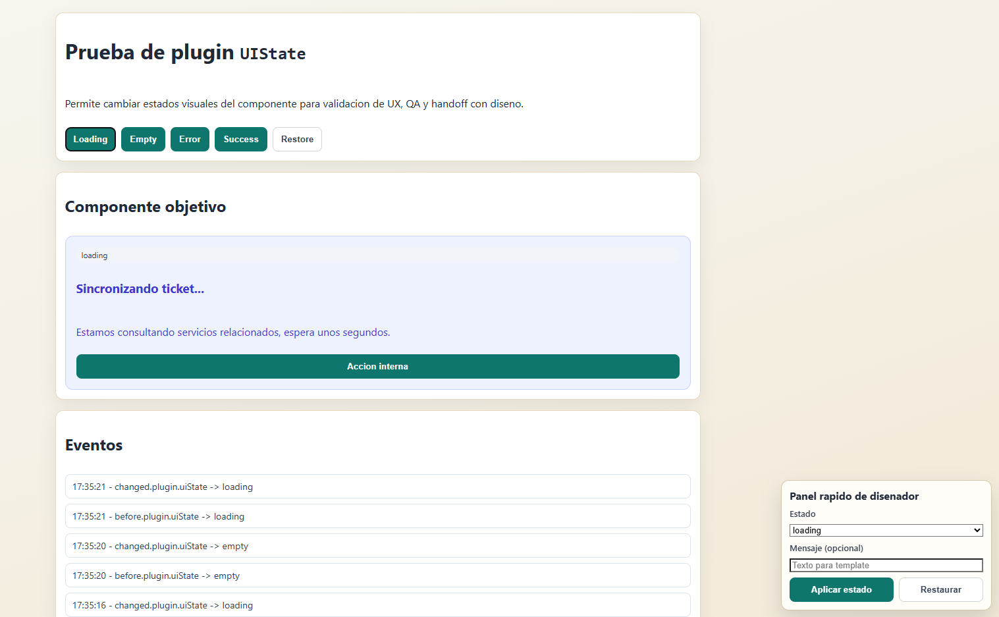

# UIState

Plugin JavaScript nativo para previsualizar y alternar estados de UI (loading, empty, error, success, disabled) sin reescribir codigo del componente.

## Que viene a solucionar

En proyectos reales, los equipos suelen necesitar mostrar y validar muchos estados visuales de un mismo componente (loading, vacio, error, exito), y eso normalmente termina en codigo repetido o cambios manuales sobre el HTML.

UIState centraliza ese flujo en una sola API y en atributos `data-*`, para que desarrollo, QA y diseno puedan iterar estados de forma rapida y consistente.

## Beneficios

- Reduce codigo repetido para manejar estados en cada componente.
- Mejora la comunicacion entre desarrollo y diseno al poder previsualizar estados reales.
- Acelera QA visual al cambiar estados en vivo desde triggers o API.
- Mantiene consistencia visual con clases y templates por estado.
- Facilita demos y handoff sin depender de backend para simular escenarios.

## Requisitos

- Navegador moderno con soporte para `CustomEvent`, `WeakMap` y `MutationObserver`.
- Componentes marcados con `data-ui-state-host`.

## Instalacion

```html
<script src="./uiState.min.js"></script>
```

Para produccion, usa `uiState.min.js`. Si necesitas depurar o extender el plugin, usa `uiState.js`.

## Uso Basico

```html
<div id="cardA" data-ui-state-host data-ui-template-loading="#tplLoading" data-ui-template-error="#tplError">
  <h3>Mi componente</h3>
  <p>Contenido inicial.</p>
</div>

<button data-ui-state-trigger data-ui-state-target="#cardA" data-ui-state="loading">Loading</button>
<button data-ui-state-trigger data-ui-state-target="#cardA" data-ui-state="error" data-ui-state-message="No se pudo cargar">Error</button>
<button data-ui-state-trigger data-ui-state-target="#cardA" data-ui-state="restore">Restaurar</button>

<template id="tplLoading"><p>Cargando...</p></template>
<template id="tplError"><p>Error: {{message}}</p></template>
```

## Como Funciona

- Inicializa componentes con `data-ui-state-host`.
- Escucha triggers con `data-ui-state-trigger` y aplica el estado al target.
- Puede renderizar templates por estado.
- Emite eventos para enganchar metricas, debug o flujos personalizados.
- Permite restaurar el HTML original del componente.

## Atributos `data-*` soportados

En el host:

- `data-ui-state-host`: activa el plugin en el componente. Estado: **requerido**.
- `data-ui-state-base="default"`: estado base al restaurar. Estado: **opcional**.
- `data-ui-state-class-prefix="is-state-"`: prefijo para clases por estado. Estado: **opcional**.
- `data-ui-state-disable-on="loading,disabled"`: estados que deshabilitan controles internos. Estado: **opcional**.
- `data-ui-state-interactive-selector="button,a,input,select,textarea"`: selector de controles interactivos. Estado: **opcional**.
- `data-ui-template-loading="#tplLoading"`: template para estado loading. Estado: **opcional**.
- `data-ui-template-empty="#tplEmpty"`: template para estado empty. Estado: **opcional**.
- `data-ui-template-error="#tplError"`: template para estado error. Estado: **opcional**.
- `data-ui-template-success="#tplSuccess"`: template para estado success. Estado: **opcional**.
- `data-ui-state-class-loading="clase1 clase2"`: clase(s) para estado loading. Estado: **opcional**.
- `data-ui-state-class-empty="clase1 clase2"`: clase(s) para estado empty. Estado: **opcional**.
- `data-ui-state-class-error="clase1 clase2"`: clase(s) para estado error. Estado: **opcional**.
- `data-ui-state-class-success="clase1 clase2"`: clase(s) para estado success. Estado: **opcional**.

En el trigger:

- `data-ui-state-trigger`: marca el trigger. Estado: **requerido en trigger**.
- `data-ui-state-target="#idHost"`: selector del host objetivo. Estado: **requerido en trigger**.
- `data-ui-state="loading|error|success|restore"`: estado a aplicar. Estado: **requerido en trigger**.
- `data-ui-state-message="texto"`: mensaje opcional para template. Estado: **opcional**.
- `data-ui-state-html="<div>..."`: HTML opcional directo para render. Estado: **opcional**.

## API publica

```html
<script>
  const host = document.querySelector('#cardA');

  const instance = window.UIState.init(host, {
    baseState: 'default',
    classPrefix: 'is-state-',
    disableOnStates: ['loading', 'disabled'],
    templates: {
      loading: '<p>Cargando modulo...</p>'
    },
    beforeChange: function (detail) {
      console.log('before', detail);
    },
    afterChange: function (detail) {
      console.log('changed', detail);
    },
    afterRestore: function (detail) {
      console.log('restored', detail);
    }
  });

  instance.setState('loading', { message: 'Procesando' });
  instance.setState('error', { message: 'No disponible' });
  instance.restore();

  window.UIState.getInstance(host);
  window.UIState.destroy(host);
  window.UIState.initAll(document);
  window.UIState.destroyAll(document);
</script>
```

### Multiples clases por estado

Puedes definir multiples clases separadas por espacios directamente en atributos del host:

```html
<article
  id="cardA"
  data-ui-state-host
  data-ui-state-class-loading="is-state-loading u-glow u-fade"
  data-ui-state-class-error="is-state-error u-outline-error u-border-strong"
  data-ui-state-class-success="is-state-success u-glow"
></article>
```

Tambien puedes hacerlo por inicializacion JS con `stateClassMap`:

```html
<script>
  window.UIState.init(document.querySelector('#cardA'), {
    stateClassMap: {
      loading: 'is-state-loading u-glow u-fade',
      error: 'is-state-error u-outline-error u-border-strong',
      success: 'is-state-success u-glow'
    }
  });
</script>
```

## Eventos del plugin

- `before.plugin.uiState`: antes de cambiar estado (cancelable).
- `changed.plugin.uiState`: despues de aplicar estado.
- `restored.plugin.uiState`: al restaurar estado base.

## Demo

- `test-ui-state.html`
- Incluye un panel flotante de disenador para aplicar estados y mensajes en vivo.

## Vista previa


