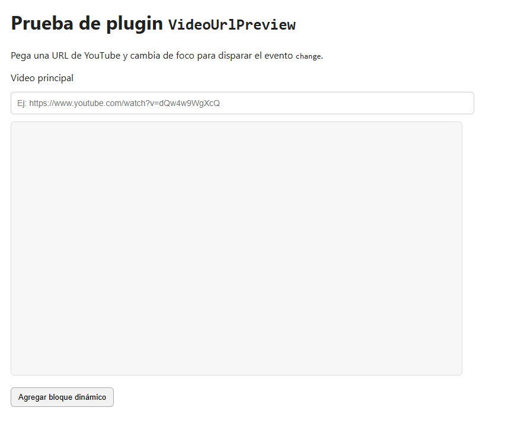
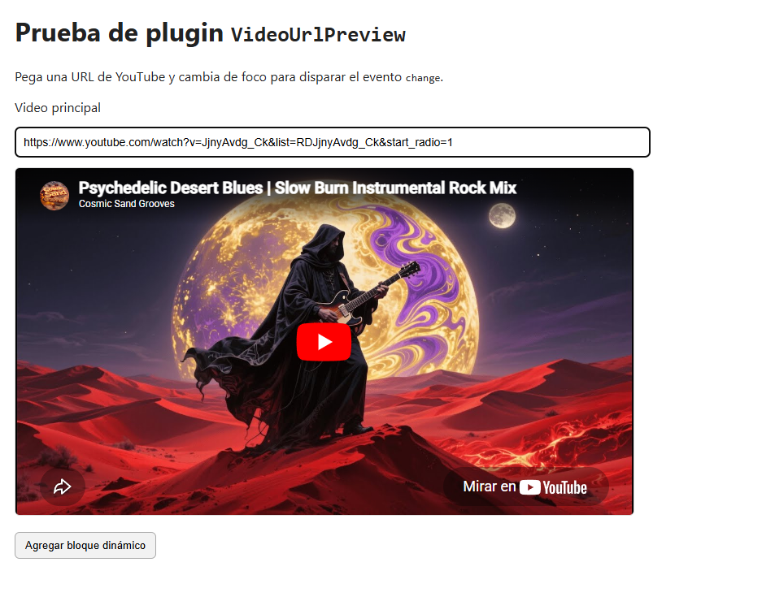

# VideoUrlPreview

Native JavaScript plugin to preview YouTube videos inside an `<iframe>` from a URL entered in an `<input>`.

## Problem it solves

Solves immediate validation and preview of YouTube URLs, avoiding repeated parsing and embed logic implementations.

## Benefits

- Instant feedback when a URL is pasted.
- Fewer mistakes from invalid links.
- Fast integration in content forms.
- Reusable in CMS panels, blogs, and admin tools.

## Requirements

- A modern browser with support for `MutationObserver`, `WeakMap`, and `queueMicrotask`
- An `<input>` with the `data-video-preview-target-frame` attribute
- A target `<iframe>`

## Installation

Include only the plugin:

```html
<script src="./VideoUrlPreview.js"></script>
```

For production usage, if you do not need to read the source code, you can include the minified file:

```html
<script src="./VideoUrlPreview.min.js"></script>
```

## Basic Usage

```html
<input
  type="text"
  data-role="video-preview"
  data-video-preview-target-frame="#previewFrame1"
  placeholder="https://www.youtube.com/watch?v=dQw4w9WgXcQ" />

<iframe id="previewFrame1" allowfullscreen></iframe>
```

That is enough. The plugin initializes automatically when the DOM is ready.

## How It Works

- Reads the iframe selector from `data-video-preview-target-frame`.
- On `input` event: updates preview only when a valid YouTube ID is detected.
- On `change` event (blur/enter): if the value is invalid, clears the iframe `src`.
- If the input already has a value during initialization, it tries to render the preview.

## Supported `data-*` attributes

- `data-role="video-preview"`: marks the URL input for auto-initialization. Status: **required**.
- `data-video-preview-target-frame`: CSS selector of the `<iframe>` where the video is rendered. Status: **required**.

## Automatic Initialization

The plugin auto-initializes on:

- `input[data-role="video-preview"]`
- `input[data-video-preview-target-frame]`

It also uses `MutationObserver` to initialize inputs added dynamically to the DOM and tear down instances when those nodes actually leave the document.

## Manual Initialization (optional)

If you need to initialize a specific block manually:

```html
<script>
  window.Plugins.VideoUrlPreview.init(document.querySelector('#myInput'));
  // or on a full container
  window.Plugins.VideoUrlPreview.initAll(document.querySelector('#myForm'));
</script>
```

## Public API

```html
<script>
  const input = document.querySelector('#myInput')
      , instance = window.Plugins.VideoUrlPreview.init(input);

  window.Plugins.VideoUrlPreview.getInstance(input);
  window.Plugins.VideoUrlPreview.destroy(input, { clearPreview: true });
  window.Plugins.VideoUrlPreview.destroyAll(document.querySelector('#myForm'));

  instance.destroy();
</script>
```

- `window.Plugins.VideoUrlPreview.init(element, options)`: creates or reuses an instance.
- `window.Plugins.VideoUrlPreview.getInstance(element)`: returns the current instance or `null`.
- `window.Plugins.VideoUrlPreview.destroy(element, options)`: tears down a specific instance.
- `window.Plugins.VideoUrlPreview.destroyAll(root, options)`: tears down all instances inside a container.
- `instance.destroy(options)`: removes listeners for the current instance.
- `clearPreview: true`: option to clear the `<iframe>` `src` on destroy.

In normal usage you do not need to call `destroy()`: if the node is removed from the DOM, the plugin attempts to tear it down automatically.

## Supported URL Formats

Common YouTube URL formats are supported, for example:

- `https://www.youtube.com/watch?v=VIDEO_ID`
- `https://youtu.be/VIDEO_ID`
- `https://www.youtube.com/embed/VIDEO_ID`

## Common Errors

- Missing `data-video-preview-target-frame`: throws an error.
- Selector not found: shows `console.warn`.
- Selector does not point to an `<iframe>`: throws an error.

## Demo

You can open the test file included in this project:

- `test-video-url-preview.html`

## Example Preview

Initial HTML state:



State with a YouTube link loaded (preview shown):




## Plugin Observer Configuration

If you want to scope this plugin `MutationObserver` to a specific container, define a direct root:

```html
<section data-pp-observe-root-video-url-preview>...</section>
```

Plugin root priority:

1. `data-pp-observe-root-video-url-preview`
2. `data-pp-observe-root` on `<html>`
3. `document.body`

#### ℹ️ For details on the observer pattern and how to optimize automatic plugin initialization, see the section [Recommended Observer Pattern](../README.en.md#recommended-observer-pattern) in the main README.

## License

This plugin is distributed under the MIT license.
See the LICENSE file in the repository root for full terms.

Copyright (c) 2026 Samuel Montenegro